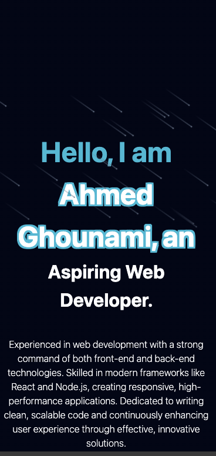

 

<h2 style="color: blue" > 42 Cursus <h2>
 

 
 

### About me

- **Student at 1337 coding school** 
- **Languages:** C, C++, HTML, CSS, JavaScript, ...
- **Interests:** Frontend and Backend Development
- **Certification:** "The common core of the 42 curriculum represents the minimum set of skills to be ready for a first professional experience. It provides basic and standard coding skills, as well as a fruitful range of soft skills."

## &#x1f4c8; GitHub Stats

# 📣 How to Contact Me

You can reach out to me through various platforms. Feel free to connect with me!

  
  
  

